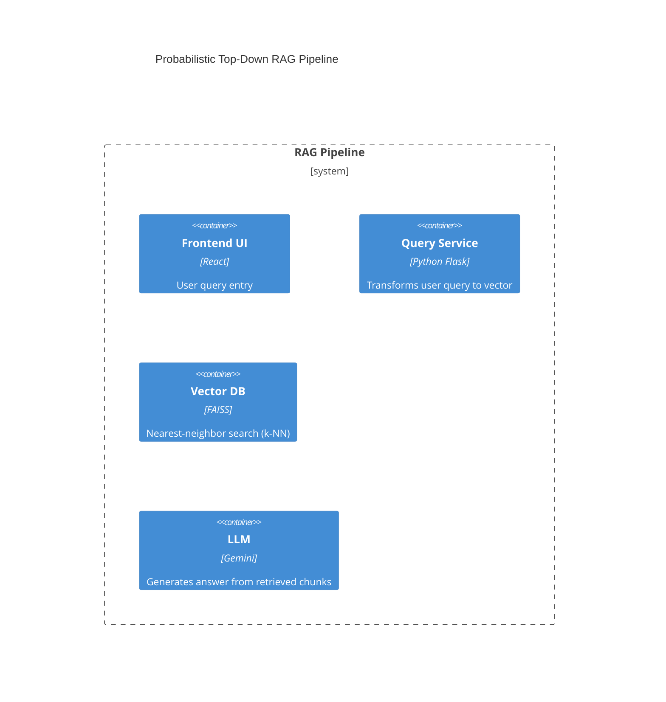
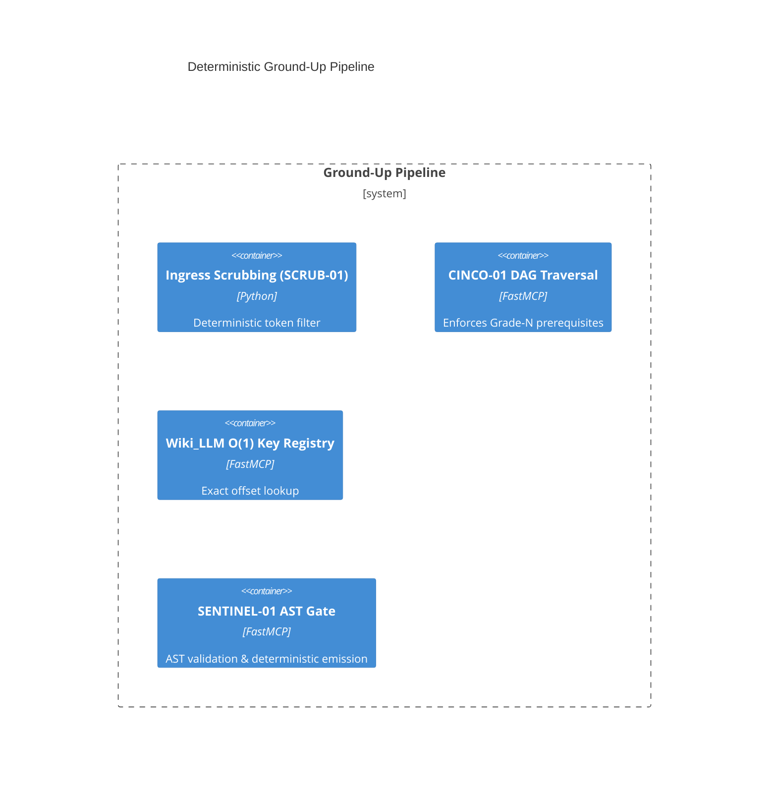

# 02_Ground_Up_vs_RAG_Down

## Executive Breakdown – 5% Semantic Fuzziness Problem
Vector‑DB based RAG pipelines introduce a **semantic fuzziness** of roughly 5 % due to nearest‑neighbor approximation in high‑dimensional spaces. This uncertainty propagates through multi‑step reasoning, causing non‑deterministic token drift.

## Mathematical Formulations
### Cosine Similarity Error Propagation
Let `c_i` be the cosine similarity of the *i‑th* retrieved chunk and `e_i` the associated error term.
```
E_total = Σ_i (1 - c_i) * e_i   // linear accumulation of similarity loss
``` 
A 5 % average loss (`c̄ ≈ 0.95`) yields `E_total ≈ 0.05 Σ_i e_i`.

### Quadratic Token Burn & Attention Decay
Token burn grows quadratically with the number of fuzzy chunks `k`:
```
Token_Burn(k) = α * k^2 + β * k   // α,β > 0 constants for attention decay
``` 
With `k` increasing to satisfy context window, burn quickly dominates the effective context.

### O(1) Key Lookup Efficiency vs. Vector NN Search
Deterministic O(1) lookup cost:
```
T_lookup = γ   // constant time (hash / offset)
``` 
Vector nearest‑neighbor search cost (approx):
```
T_nn ≈ O(log N) + Δ_search   // N = corpus size, Δ_search = index traversal overhead
``` 
For large `N`, `T_nn` grows unbounded, whereas `T_lookup` remains fixed.

## Architectural C4 Container Diagrams



## Knowledge Boundaries – State Machine Comparison
| Aspect | Probabilistic (RAG) | Deterministic (Ground‑Up) |
|---|---|---|
| Uncertainty handling | Implicit fuzziness; hallucinations allowed. | Explicit `UNKNOWN_ENTITY`, `UNKNOWN_DEPENDENCY`, `PREREQUISITE_FAILURE` states block progress. |
| Output guarantees | Best‑effort generation; may diverge from source. | Formal verification of AST rules; output traceable to source offsets. |
| Error mode | Soft failure – lower confidence scores. | Hard failure – pipeline halts until missing entity resolved. |

*The deterministic pathway eliminates the 5 % fuzziness, guaranteeing reproducible outputs.*

Code snippet
{
  "node_id": "cinco::grade3::rag_down_thesis",
  "grade_level": 3,
  "causal_prerequisites": ["cinco::grade2::level4_invariants"],
  "verification_state": "VALIDATED",
  "ast_rule_hash": "f0e1d2c3b4a5968778695a4b3c2d1e0f0e1d2c3b4a5968778695a4b3c2d1e0f0"
}

```dag_node
{
  "node_id": "cinco::grade3::rag_down_thesis",
  "grade_level": 3,
  "causal_prerequisites": [
    "cinco::grade2::level4_invariants"
  ],
  "verification_state": "VALIDATED",
  "ast_rule_hash": "f0e1d2c3b4a5968778695a4b3c2d1e0f0e1d2c3b4a5968778695a4b3c2d1e0f0"
}
```
